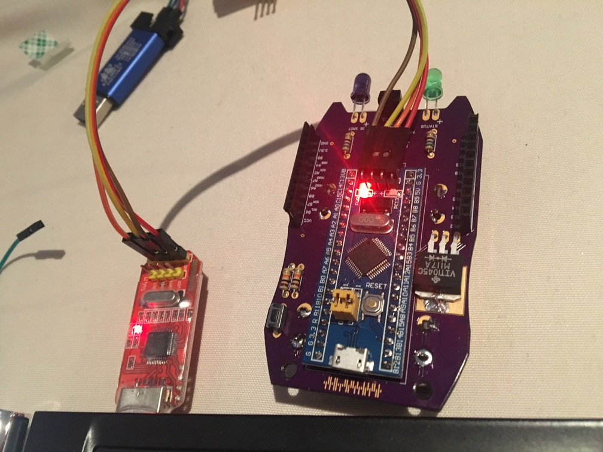

# DC Darknet Code Dumper Tool

## Requirements
* DC Darknet badge (2016)
* ST-Link v2 (JTAG/SWD tool)
* openOCD ([Installation Instructions](http://gnuarmeclipse.github.io/openocd/install/))

## How to use

(Currently tested on Ubuntu 16.04)

1. Connect ground on the st-link to ground on the microcontroller
1. Connect SWCLK on the st-link to DCLK on the microcontroller
1. Connect SWDIO on the st-link to DIO on the microcontroller
1. Connect 3.3V on the st-link to 3.3 on the microcontroller
1. Run the following command from this directory:

`python dump_info.py --openocd_dir /opt/gnuarmeclipse/openocd/0.10.0-201601101000-dev/`



### Example Output

```
alvaro@portege:~/code/darknet_code_dumper$ python dump_info.py --openocd_dir /opt/gnuarmeclipse/openocd/0.10.0-201601101000-dev/
contacts:
name:CMDC0DE
public key:5A5A5A5A5A5A5A5A5A5A5A5A5A5A5A5A5A5A5A5A5A5A5A5A5A
signature:5A5A5A5A5A5A5A5A5A5A5A5A5A5A5A5A5A5A5A5A5A5A5A5A5A5A5A5A5A5A5A5A5A5A5A5A5A5A5A5A5A5A5A5A5A5A5A5A

name:MANSEL
public key:5A5A5A5A5A5A5A5A5A5A5A5A5A5A5A5A5A5A5A5A5A5A5A5A5A
signature:5A5A5A5A5A5A5A5A5A5A5A5A5A5A5A5A5A5A5A5A5A5A5A5A5A5A5A5A5A5A5A5A5A5A5A5A5A5A5A5A5A5A5A5A5A5A5A5A

name:GATER BYTE
public key:5A5A5A5A5A5A5A5A5A5A5A5A5A5A5A5A5A5A5A5A5A5A5A5A5A
signature:5A5A5A5A5A5A5A5A5A5A5A5A5A5A5A5A5A5A5A5A5A5A5A5A5A5A5A5A5A5A5A5A5A5A5A5A5A5A5A5A5A5A5A5A5A5A5A5A
```
